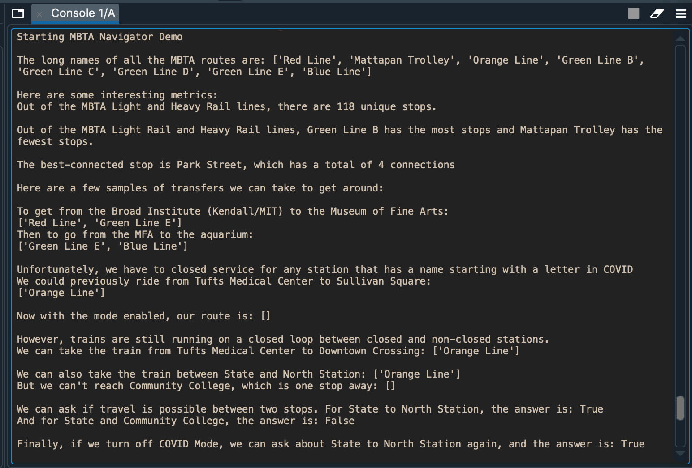

## MBTA Rail Line Exploration
Li McCarthy | Last Updated Mar. 8 2021

### Summary  
  
This is a small program that queries the open-source MBTA API (https://www.mbta.com/developers/v3-api) and uses it to answer questions about the rail lines (Light Rail and Heavy Rail).  A demo program (NavigatorDemo.py) is provided that prints some sample output demonstrating how the program works.  A screenshot of the output is attached at the end of this page.  

### Data  
  
The MBTA API allows for retrieval of rich data related to bus and train line scheduling, stop locations, alerts, facilities, and more.  We focus on the limited scope of Light and Heavy Rail line Routes and Stops. Coloquially, a Route is a train line: the Red Line, Blue Line, Orange Line, Mattapan Trolley, and Green Lines B, C, D, and E. The Green Line branches are treated as separate Routes, while the Red Line branches are referred to by the same Red Line designation.  While technically contiguous with the Red Line on maps of the MBTA, the Mattapan Trolley is an independent Route that runs between Ashmont and Mattapan.
  
A Stop in this representation refers to one station along each Line.  A Stop is associated with one or more Routes, representing transfers that can occur at each Stop.  

### How to Use  
  
The program can be run manually by instantiating MBTANavigator.py.  An API Key is optional but recommended (https://api-v3.mbta.com/register) to avoid being rate-limited.  To load data, first enter the API Key or load it from a file with ```loadKey(key)``` or ```loadKeyFromFile(filename)```.  Then call ```getData()``` to generate internal data structures.  
  
```loadKey(String)``` stores a user-entered API key.  
  
```loadKeyFromFile(String)``` loads a key from file.  
  
```getData()``` connects to and queries the API and builds the internal representation for train routes and stops.
  
```getLongNames()``` returns a list of all long names for routes in the MBTA system (e.g. Red Line, Orange Line).  
  
```getUniqueStops()``` returns the total number of unique stops across all routes.  

```getMostStops()``` returns the long name of the route with the most stops.  
  
```getFewestStops()``` returns the long name of the route with the fewest stops.  
  
```getMostConnectivity()``` returns the name of the stop with the most connections to other stops.  
  
```getRoutesBetweenStops(String, String)``` returns a list of routes one can take to travel from the first input stop to the second input stop.  If none, returns an empty list.

```setCovidMode(bool)``` sets a special mode that closes any stops that include a character in ['C', 'O', 'V', 'I', 'D'], case-sensitive.  Connected closed stops can be travelled between and connected open stops can be travelled between, but closed and open stops are cut off from each other and cannot be travelled between. Setting this mode to false restores the previous state of closures and removes the special mode.
  
```travelIsPossible(String, String)``` returns whether it is possible to travel between two stops.
  
### Design  
  
MBTANavigator provides an interface for simple queries.  To generate paths, it builds a directed graph of stops (StopGraph.py) that is sensitive to stop closures.  Getting the list of routes between two stops first uses a breadth-first search on the graph to find the shortest path between the stops from the graph, then MBTANavigator translates the list of stops into a list of routes with a greedy selection of the first intersecting route between each pair of stops. Transfers are treated as negligible -- the MBTA has relatively low connectivity, so it would typically be unlikely to generate a labor-intensive series of transfers that has fewer stops rather than one direct path that has more stops. Realistically, generating the optimal list of routes between point A and point B would also weight transfers from one route to another.  
  
### Demo Output  
  

